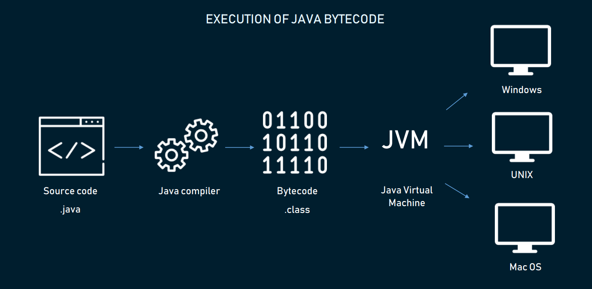

---

# Conceptos Básicos
carlos.belloda@inetum.com


---

# WORE



---


---

# Estructura de una clase en Java

MyFirstClass.java
```java

class MyFirstClass {

  public static void main(String[] args) {
    System.out.println("Hola Mundo Java");
  }
  
}

```

---
# java package
###### pe.com.inetum.training


---

# Variables


[comment]: <> (We think that the object reference variable holds an object. But, the object reference variable holds bits that represent a way to access an object. Object reference variable like remote control of an object and It has a type but it doesn’t have exactly a size)

---

## Primitivas


| Tipo | bit depth| Ejemplo                                                  |
|--------------|-------------------|----------------------------------------------------------|
| boolean      | --             | boolean mivariable = false; |
| char         | 16          | char mivariable = 'a';                      |
| byte         | 8                 | byte mivariable = 20;                                    |
| short        | 16                 | short mivariable = 2000;                                 |
| int          | 32                 | int mivariable = 20000;                                  |
| long         | 64                | long mivariable = 200000L;                               |
| float        | 32              | float mivariable = 567.8f;                               |
| double       | 64              | double mivariable = 15.7;                                |


---

# Variable de referencia de objeto

```java
Dog fido = new Dog();
Dog firulais = new Dog();
firulais = fido;
```

---

# Métodos en clases java

```java
private int mehotdSum(Integer x , String y){

    return x+1;
}
```

---

# Modificadores de clases

| Modificador | Descripción|
|--------------|-------------------|
| public      | La clase es accesible por cualquier otra clase             |
| default         | La clase es accesible solo desde el mismo paquete       |

---
# Modificadores de atributos metodos y constructores

| Modificador | Descripción|
|--------------|-------------------|
| public      | Accesible para todas las clases |
| private         | El código es accesible desde la propia clase |
| default         | El código es accesible en el mismo paquete |
| protected         | El código es accesible en el mismo paquete y subclases|

---
# Modificadores de no-acceso para clases

| Modificador | Descripción|
|--------------|-------------------|
| final      | La clase no puede ser heredada de otra clase |
| abstract         | la clase no puede ser creada |

---

# Modificadores de no acceso para atributos y métodos

| Modificador | Descripción|
|--------------|-------------------|
| final      | atributos y métodos no pueden ser modificados |
| static         | atributos y métodos pertenecen a la clase y no a los objetos |
| abtract         | solo puede ser usado en clases abstractas |


---

# Estructuras de control


---


# Herencia 


---

# Genéricos

